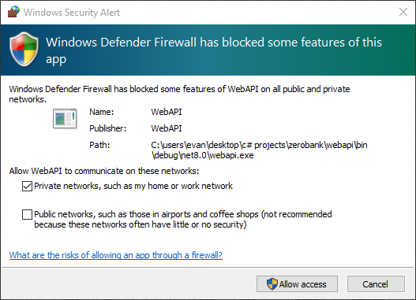

@ -1,105 +1,2 @@

# ZeroBank

A Windows desktop app prototype for private financial transactions using homomorphic encryption.

## Table of Contents

1. [Getting Started](#getting-started)
2. [Client Guide](#client-guide)
3. [Admin Guide](#admin-guide)
4. [Technologies](#technologies)

## Getting Started

<details>
<summary><strong>Run from .exe files</strong></summary>

1. Download and extract the following zip files:

   | File Link                                                                                               | SHA256 Hash                                                        |
   | ------------------------------------------------------------------------------------------------------- | ------------------------------------------------------------------ |
   | [ZeroBank-Server.zip](https://github.com/EvanHei/ZeroBank/releases/download/v1.0.0/ZeroBank-Server.zip) | `bd82b70133d8d4537c4d1b5a8b564aeab9f45861cb04b1b3b5e421493fdca203` |
   | [ZeroBank-Client.zip](https://github.com/EvanHei/ZeroBank/releases/download/v1.0.0/ZeroBank-Client.zip) | `f8aea322aada306116fafe5a702dac5d771d00848a9cfff4463d852f0e0b6703` |
   | [ZeroBank-Admin.zip](https://github.com/EvanHei/ZeroBank/releases/download/v1.0.0/ZeroBank-Admin.zip)   | `8934c5438720436da3ac6a91116600451682906e6de076330d4b3139903910ea` |

2. Double-click WebAPI.exe to start the server, and then double-click either ClientUI.exe or AdminUI.exe to use as a client or admin, respectively.

   If there is a security prompt, click "More info", and then click "Run anyway". This prompt will disappear the next time each is run.

   If a Windows Defender Firewall prompt appears, select "Private Networks" and click "Allow Access." ZeroBank is a prototype and does not need to communicate with public networks.

   

</details>

<details>
<summary><strong>Run from source code</strong></summary>

1. Download the .NET SDK from Microsoft's website <a href="https://dotnet.microsoft.com/download"> here</a> or verify installation by running the following command:

   ```powershell
   dotnet --version
   ```

2. Navigate to the `ZeroBank` root directory and launch the WebAPI, CLientUI, and AdminUI using the following commands from PowerShell:

   **WebAPI**

   ```powershell
   dotnet run --project .\WebAPI\WebAPI.csproj
   ```

   **ClientUI**

   ```powershell
   dotnet run --project .\WinFormsUI\ClientUI.csproj
   ```

   **AdminUI**

   ```powershell
   dotnet run --project .\AdminUI\AdminUI.csproj
   ```

</details>

<details>
<summary><strong>Remove Files</strong></summary>

1. Delete WebAPI.exe, ClientUI.exe, and AdminUI.exe.

2. Delete the folder at `C:\Users\<username>\AppData\Roaming\ZeroBank`

</details>

## Client Guide

### Dashboard Tab

The client's Dashboard tab displays tiles for the user guide and creating a new account. Furthur development may add new tiles for additional features.

   

- **User Guide**: opens this README in a new browser tab.
- **Create Account**: opens the account creation panel.

### Accounts Tab

The client's Accounts tab displays a list of all accounts which may be filtered based on open/closed status. A client must input a password if they are to access an account's details or make transactions.

   

- **Create New**: opens the account creation dialog.
- **Delete**: deletes an account if it has no transactions.

### Account Details

Viewing an account's details after providing a password displays all data about the account and allows a client to make transactions.

   

- **Transact**: makes a deposit or withdrawal.
- **Close**: reveals the secret key to the server to facilitate decryption of transaction amounts.

## Admin Guide

### Account Tab

Admins may view all accounts of all users in a list which may be filtered based on open/closed status.

   

- **View Details**: shows all the account details currently available.

### Account Details (Encrypted)

Admins may only view an account's metadata if the client has and open account. Individual transaction amounts are hidden, but a range of possible balances may be computed using properties of homomorphic encryption. The bounds are found as follows:

**Upper Bound** = (maximum possible transaction size) \* (number of transactions)

**Lower Bound** = (minimum possible transaction size) \* (number of transactions)

   

- **Close**: freezes the client's account. This may be necessary if the range becomes too large for the bank's risk appetite.

### Account Details (Decrypted)

Admins may view an account's metadata and transaction amounts if the client has closed their account.

   

- **Close**: freezes the client's account. This may be useful if later development allows a user to continue making transactions after revealing the secret key.

## Technologies

- **OS**: Windows
- **IDE**: Visual Studio
- **Programming Language**: C#
- **Framework**: .NET
- **GUI**: Windows Forms
- **Wireframing**: Figma
- **Version Control**: Git / GitHub
- **Encryption**:
  - **Symmetric**: AES
  - **Asymmetric**: RSA
  - **Homomorphic**: BFV
- **Authentication**: JWT
- **Logging**: Microsoft.Extensions.Logging
- **Unit Testing**: xUnit
