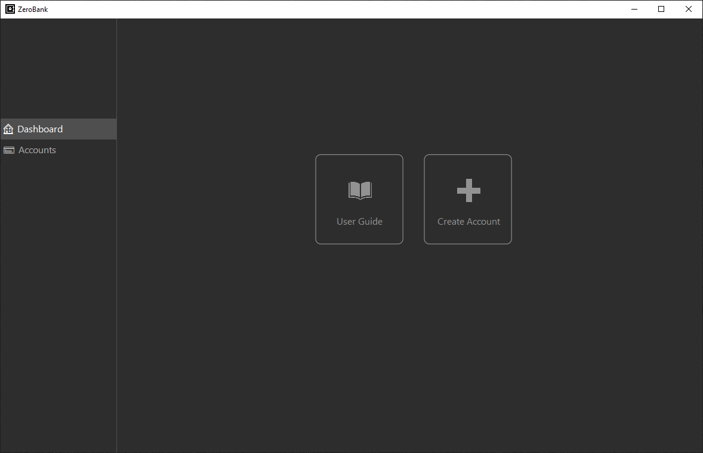
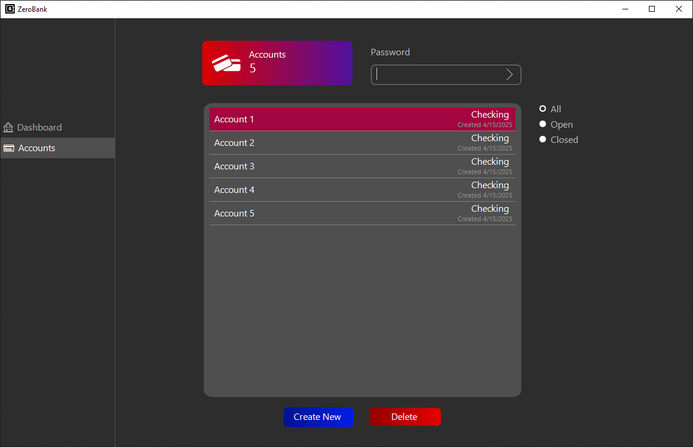
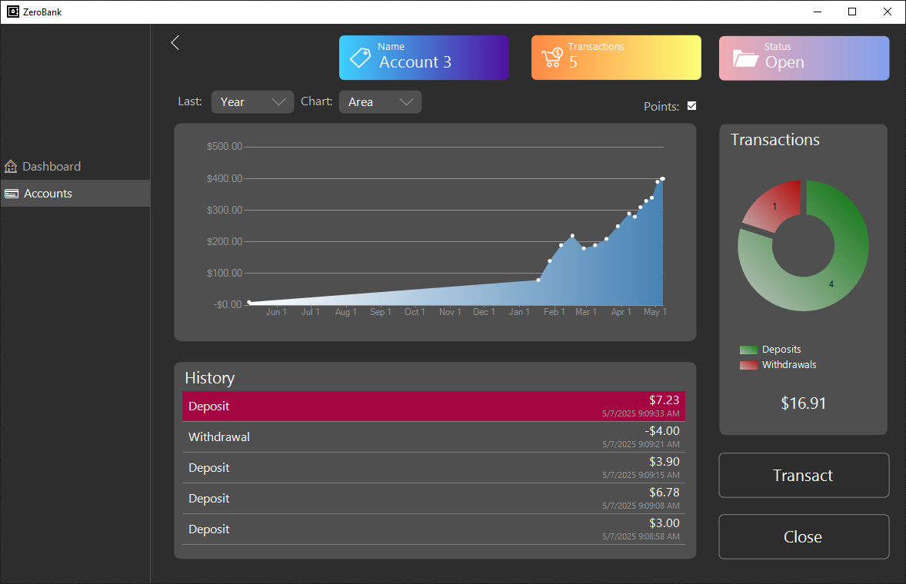
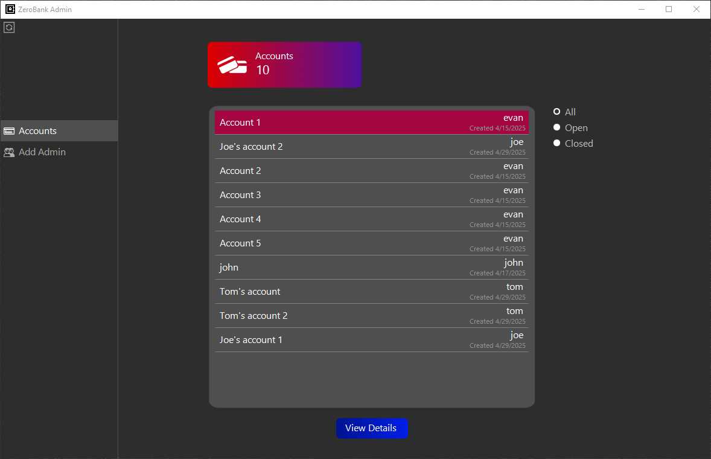
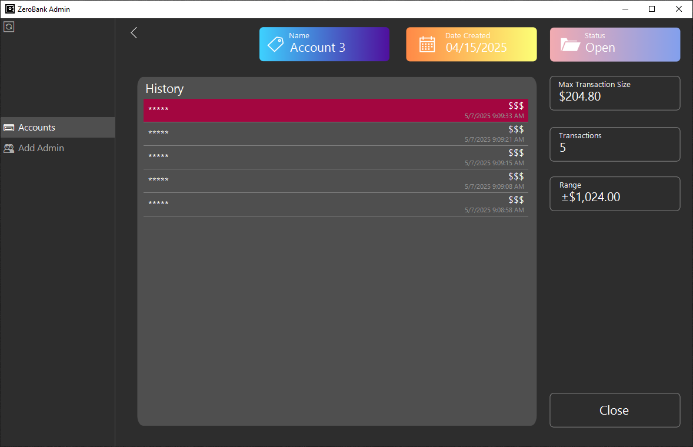

@ -1,105 +1,2 @@

# ZeroBank

A Windows desktop app prototype for private financial transactions using homomorphic encyrption.

## Table of Contents

1. [Getting Started](#getting-started)
2. [Guide](#guide)
3. [Technologies](#technologies)

## Getting Started

<details>
<summary><strong>Run from executable</strong></summary>

1. Download [ZeroBank.exe](RELEASE_URL) (SHA256 below)

   ```SHA256
   <SHA256_HASH>
   ```

2. Double-click ZeroBank.exe, click "More info", and then click "Run anyway". This prompt will disappear the next time ZeroBank is run.

</details>

<details>
<summary><strong>Run from source code</strong></summary>

1. Download the .NET SDK from Microsoft's website <a href="https://dotnet.microsoft.com/download"> here</a> or verify installation by running the following command:

   ```bash
   dotnet --version
   ```

2. Navigate to `<SOURCE_DIRECTORY>` and launch with the following command:

   ```bash
   dotnet run
   ```

</details>

## Client UI Guide

### Dashboard Tab

The client's Dashboard tab displays tiles for the user guide and creating a new account. Furthur development may add new tiles for additional features.

   

- **User Guide**: opens this README in a new browser tab.
- **Create Account**: opens the account creation panel.

### Accounts Tab

The client's Accounts tab displays a list of all accounts which may be filtered based on open/closed status. A client must input a password if they are to access an account's details or make transactions.

   

- **Create New**: opens the account creation dialog.
- **Delete**: deletes an account if it has no transactions.

### Account Details
Viewing an account's details after providing a password displays all data about the account and allows a client to make transactions.

   

- **Transact**: makes a deposit or withdrawal.
- **Close**: reveals the secret key to the server to facilitate decryption of transaction amounts.

## Admin UI Guide

### Account Tab

Admins may view all accounts of all users in a list which may be filtered based on open/closed status.

   

- **View Details**: shows all the account details currently available.

### Account Details (Encrypted)

Admins may only view an account's metadata if the client has and open account. Individual transaction amounts are hidden, but a range of possible balances may be computed using properties of homomorphic encryption. The bounds are found as follows:

**Upper Bound** = (maximum possible transaction size) * (number of transactions)

**Lower Bound** = (minimum possible transaction size) * (number of transactions)

   

- **Close**: freezes the client's account. This may be necessary if the range becomes too large for the bank's risk appetite.

### Account Details (Decrypted)

Admins may view an account's metadata and transaction amounts if the client has closed their account.

   

- **Close**: freezes the client's account. This may be useful if later development allows a user to continue making transactions after revealing the secret key.

## Technologies

- **OS**: Windows
- **IDE**: Visual Studio
- **Programming Language**: C#
- **Framework**: .NET
- **GUI**: Windows Forms
- **Wireframing**: Figma
- **Version Control**: Git / GitHub
- **Encryption**:
  - **Asymmetric**: RSA
  - **Homomorphic**: BFV
- **Authentication**: JWT
- **Logging**: Microsoft.Extensions.Logging
- **Unit Testing**: xUnit
